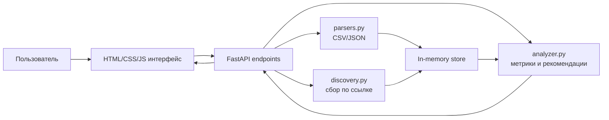
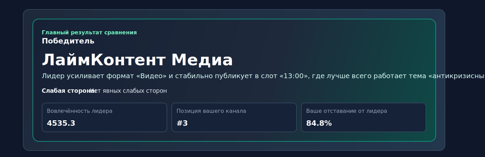

# Content Radar

Content Radar — MVP-сервис для маркетолога, который сравнивает свой контент-канал с конкурентами, показывает лидеров по вовлечённости и предлагает конкретные действия для роста

Проект создан в рамках хакатона [CodeGryphon](https://hackathon.codegryphon.self.team/) для маркетингового трека и занял 2 место

---

## Содержание

- [Установка и запуск](#установка-и-запуск)
- [Основной функционал](#основной-функционал)
- [Технологии и инструменты](#технологии-и-инструменты)
- [Команда проекта](#команда-проекта)
- [Архитектура и структура проекта](#архитектура-и-структура-проекта)
- [Демонстрация работы](#демонстрация-работы)
- [API](#api)
- [Безопасность](#безопасность)
- [Развитие проекта](#развитие-проекта)
- [Лицензия](#лицензия)

---

## Установка и запуск

### 1. Клонировать репозиторий

```powershell
git clone https://github.com/Vikvins/Content-radar.git
cd Content-radar
```

### 2. Создать и активировать виртуальное окружение

```powershell
python -m venv .venv
.\.venv\Scripts\Activate.ps1
```

Для macOS или Linux:

```bash
python3 -m venv .venv
source .venv/bin/activate
```

### 3. Установить зависимости

```powershell
pip install -r requirements.txt
```

### 4. Запустить проект локально

```powershell
python -m uvicorn app.main:app --reload
```

После запуска интерфейс будет доступен по адресу `http://127.0.0.1:8000`

Health-check доступен по адресу `http://127.0.0.1:8000/health`

### 5. Запустить smoke-проверку

```powershell
python scripts/smoke_scenarios.py
```

Скрипт проверяет ключевые сценарии MVP: демоданные, сбор и выбор постов, анализ, сброс состояния и сравнение каналов

---

## Основной функционал

- Сравнение своего канала с несколькими конкурентами
- Загрузка постов из CSV или JSON
- Сбор открытых постов по публичной ссылке
- Демосценарий для стабильной презентации проекта
- Расчёт показателя вовлечённости по прозрачной формуле
- Рейтинг каналов и определение лидера
- Анализ разрыва между своим каналом и лидером
- Поиск лучших тем, форматов и времени публикации
- График динамики вовлечённости
- Практические рекомендации для контент-плана на ближайшие 7-14 дней
- Контролируемый fallback, если публичный источник недоступен или ограничивает данные

---

## Технологии и инструменты

| Направление | Технологии |
| --- | --- |
| Backend | Python 3.13, FastAPI, Pydantic |
| Frontend | HTML5, CSS3, Vanilla JavaScript, Jinja2 |
| Работа с HTTP | httpx |
| Валидация данных | Pydantic-модели, ручная проверка CSV/JSON |
| Хранение данных | In-memory хранилище для MVP |
| Тестирование сценариев | Smoke-скрипт `scripts/smoke_scenarios.py` |
| Деплой | Локальный запуск через Uvicorn |

---

## Команда проекта

| Участник | Роль и вклад | Профиль |
| --- | --- | --- |
| Виктория Чекалина | Идея продукта, backend, frontend, аналитическая логика, интерфейс, подготовка MVP и демонстрации | [GitHub: Vikvins](https://github.com/Vikvins) |

---

## Архитектура и структура проекта

Content Radar построен как монолитный MVP на FastAPI: backend отдаёт HTML-интерфейс, принимает пользовательские данные, вызывает сервисы анализа и возвращает JSON для дашборда



### Структура папок

```text
.
├── app/
│   ├── main.py                  # API-слой, роуты и серверная сборка ответов
│   ├── models.py                # Pydantic-модели запросов и ответов
│   ├── services/
│   │   ├── analyzer.py          # расчёт метрик, топы и рекомендации
│   │   ├── discovery.py         # сбор постов по публичной ссылке и fallback
│   │   └── parsers.py           # парсинг и валидация CSV/JSON
│   ├── static/
│   │   ├── app.js               # клиентская логика дашборда
│   │   └── styles.css           # стили интерфейса
│   └── templates/
│       └── index.html           # основной HTML-шаблон
├── data/
│   └── demo_posts.json          # демоданные для презентации
├── scripts/
│   ├── inspect_telegram_markup.py
│   ├── smoke_scenarios.py       # smoke-проверка пользовательских сценариев
│   └── telegram_probe.py
├── requirements.txt
└── README.md
```

### Логические слои

1. `app/main.py` принимает запросы, валидирует входные данные, вызывает сервисы и возвращает ответы для интерфейса
2. `app/models.py` описывает контракты API через Pydantic-модели
3. `app/services/parsers.py` отвечает за безопасную загрузку CSV и JSON
4. `app/services/discovery.py` получает посты по публичным ссылкам и включает demo fallback при ошибках источника
5. `app/services/analyzer.py` считает вовлечённость, агрегаты, рейтинг каналов и рекомендации

---

## Демонстрация работы

Локальная демонстрация доступна после запуска сервера по адресу `http://127.0.0.1:8000`



Главный сценарий:

1. Пользователь открывает дашборд
2. Указывает свой канал и каналы конкурентов
3. Выбирает количество последних постов для анализа
4. Запускает сравнение или демосценарий
5. Получает победителя, рейтинг каналов, график динамики и рекомендации

Что видно в интерфейсе:

- Форма сравнения каналов
- Блок победителя
- Таблица рейтинга
- Пояснение формулы вовлечённости
- График динамики
- Карточки с выводами и действиями

Если проект публикуется для проверки без локального запуска, сюда можно добавить ссылку на деплой: GitHub Pages, Render, Railway, Heroku, Netlify или другой хостинг

---

## API

| Метод | Эндпоинт | Назначение |
| --- | --- | --- |
| `GET` | `/` | Дашборд приложения |
| `GET` | `/health` | Проверка состояния сервиса |
| `POST` | `/upload_posts` | Загрузка постов из CSV/JSON |
| `POST` | `/discover_posts` | Сбор постов по публичной ссылке |
| `POST` | `/select_posts` | Сохранение выбранных постов |
| `POST` | `/analyze_content` | Запуск анализа контента |
| `POST` | `/compare_channels` | Сравнение своего канала и конкурентов |
| `GET` | `/insights` | Получение инсайтов и рекомендаций |
| `POST` | `/load_demo` | Загрузка демоданных |

---

## Логика анализа

### Формула вовлечённости

```text
Engagement Score = likes * 1 + comments * 2 + shares * 3 + views * 0.1
```

Формула возвращается через API в поле `engagement_formula` и показывается в интерфейсе, чтобы пользователь понимал, как именно строится рейтинг

### Сравнение каналов

Эндпоинт `/compare_channels` собирает данные по своему каналу и конкурентам, приводит посты к единой модели, считает среднюю вовлечённость, определяет лидера и формирует рекомендации для сокращения отставания

---

## Безопасность

В MVP уже учтены базовые риски работы с пользовательским вводом и публичными ссылками:

- Разрешены только `http` и `https` ссылки
- Блокируются `localhost`, loopback, private, link-local и reserved IP-адреса
- Выполняется проверка DNS-резолва на небезопасные адреса
- CSV и JSON проходят строгую валидацию
- Размер загружаемого файла ограничен 5 MB
- Сетевые и парсинговые ошибки не ломают пользовательский сценарий
- При недоступности публичных данных включается demo fallback с понятным предупреждением

Ограничения текущей версии:

- Платформы вроде Telegram или Instagram могут ограничивать публичные метрики без официального API
- Данные хранятся in-memory и сбрасываются после перезапуска сервера
- Для production-версии нужны база данных, авторизация, rate limiting, аудит действий и управление секретами

---

## Развитие проекта

Content Radar важен тем, что переводит конкурентный анализ контента из ручного просмотра постов в понятный сценарий: загрузить данные, сравнить каналы, увидеть разрыв и получить план действий

Проект отличается от обычных таблиц и ручного анализа тем, что сразу объединяет сбор данных, расчёт метрик, визуализацию и рекомендации для маркетолога

Что можно улучшить дальше:

- Добавить авторизацию и личные кабинеты
- Подключить постоянное хранение данных в PostgreSQL
- Реализовать официальный импорт через API соцсетей
- Добавить экспорт отчёта в PDF или презентацию
- Настроить регулярный мониторинг конкурентов
- Расширить аналитику ML-классификацией тем и тональности
- Упаковать проект в Docker и добавить production-деплой

---

## Лицензия

Проект распространяется под лицензией MIT
